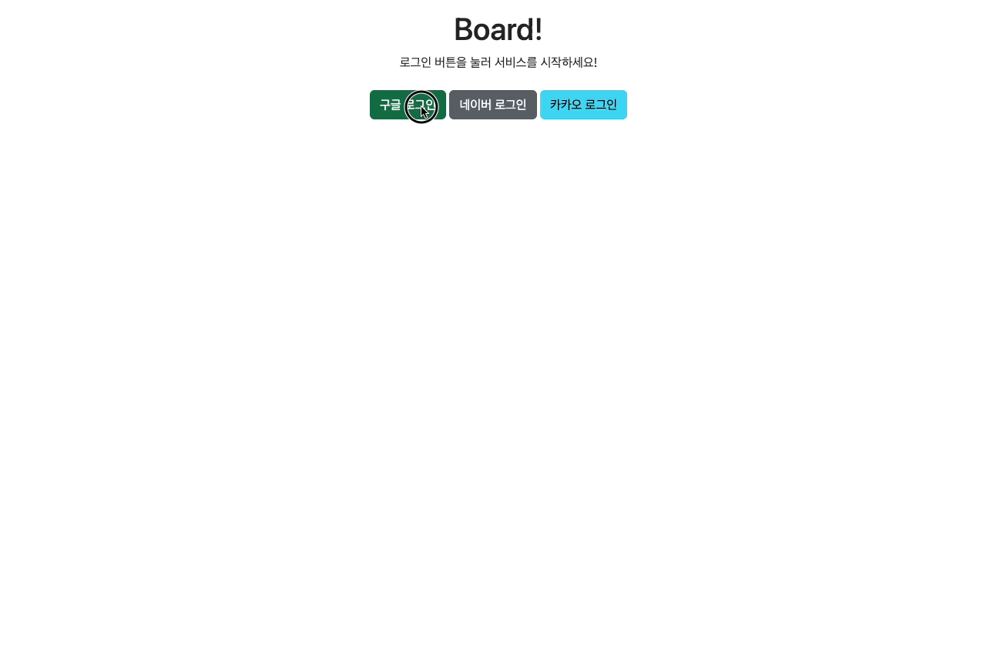
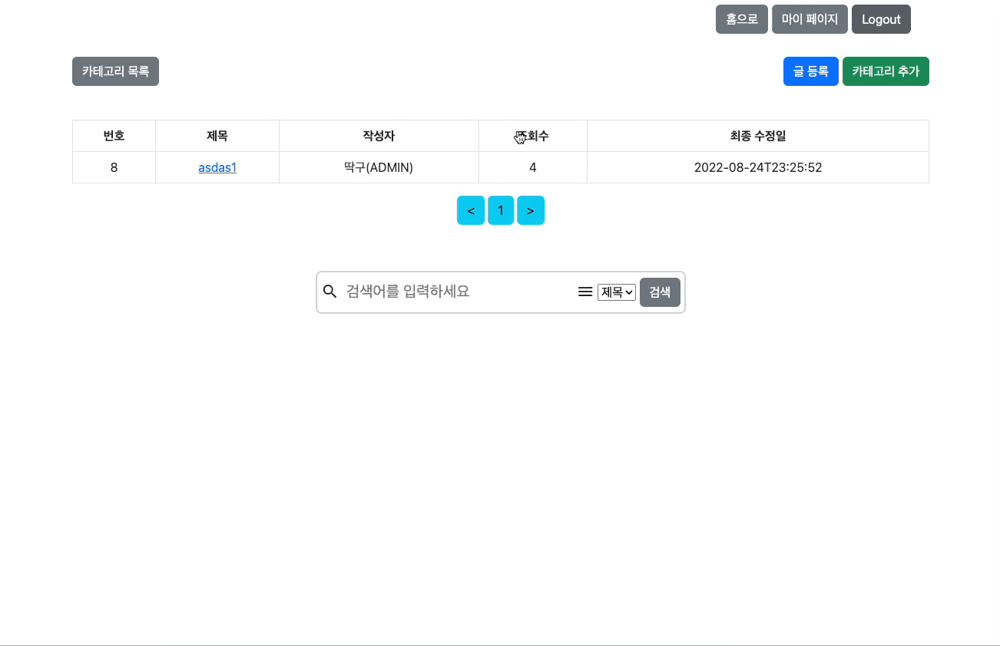
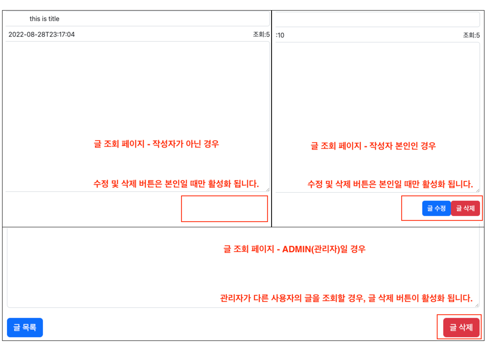
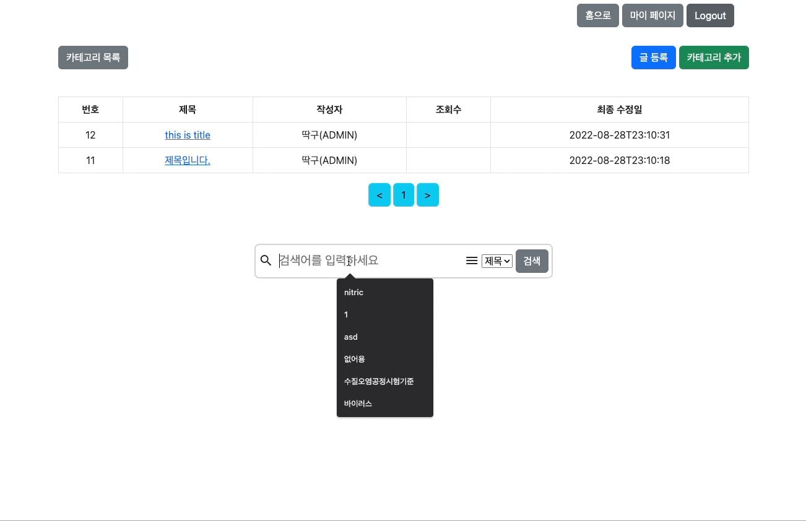
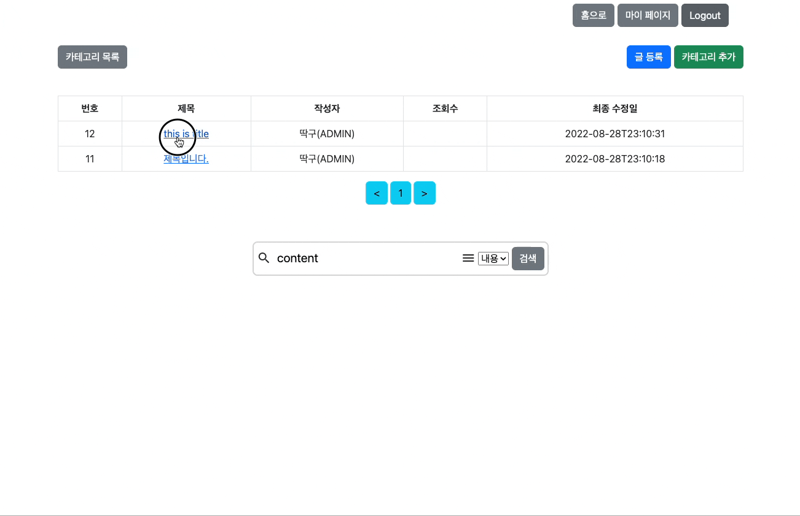
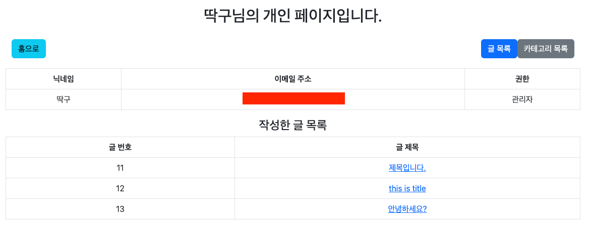
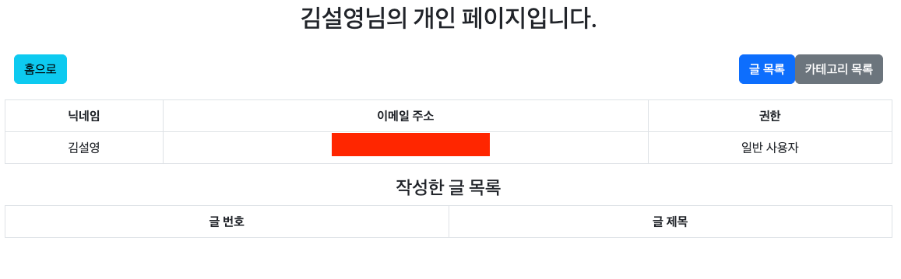

# blog-aws-practice
RestAPI(js) + Serverside template(Thymeleaf)를 혼용하여 구현한 게시판입니다.

### 현재 완료된 작업
- 글 및 카테고리 관련 CRUD
- 카테고리 기능 구현
  - 카테고리 목록 조회 기능이 있습니다.
  - 카테고리 추가 -> 관리자만 가능하도록 설정하였습니다.
  - 특정 카테고리가 할당된 글 목록 조회 기능을 추가하였습니다.
- OAuth2.0을 이용한 구글, 네이버, 카카오 로그인 구현
- Spring security를 이용한 글 수정 및 삭제 권한 부여(작성자만 가능하도록) 및 개인 페이지 구현
  - 특히, 삭제 기능은 관리자에게는 제한 없이 삭제가 가능하도록 구성하였습니다.
- 마이페이지 구현
  - 기본 개인 정보를 나타냅니다.
  - 개인이 작성한 글을 목록화 하였습니다.
- AWS EC2 + Nginx 무중단배포
- `Utterances`를 이용한 댓글 기능 추가

### 예정
- 좋아요, 싫어요, 파일업로드 기능
- 뷰 파일을 보기 좋게 변경하기
- API 문서 작성

## ERD

## 프로젝트 일지
프로젝트를 만들면서, 프로젝트 일지를 작성했습니다.
- [프로젝트 일지 바로가기](https://robust-price-530.notion.site/049dff13906643878a9f2c7e40ee44f3)

## Error Log
프로젝트를 만들면서 부딪혔던 문제들과 에러에 대한 해결 과정을 작성했습니다.
- [에러 로그 바로가기](https://robust-price-530.notion.site/ERROR-LOG-5e4b68af096b40f480c4c023c4e797c5)
- [OAuth2, Session, 그리고 테스트](https://velog.io/@kimsy8979/OAuth2-Session-%EA%B7%B8%EB%A6%AC%EA%B3%A0-%ED%85%8C%EC%8A%A4%ED%8A%B8)

## 상세 내용 소개

### 1. Spring security와 OAuth2.0을 이용한 로그인 구현

- 구글, 네이버, 카카오 로그인을 구현하였습니다.
### 2. CRUD 구현

- 수정 및 삭제 기능은 작성자 본인일 때만 버튼이 활성화됩니다.
- 관리자가 다른 사람의 글을 조회할 경우, 삭제 버튼이 활성화 됩니다.
  
### 3. 검색 기능 구현

- 제목, 내용에 따른 검색 기능을 구현하였습니다.
### 4. 조회수 기능 구현

- 본인이 아닌 다른 사람이 조회를 할 때만 조회수가 올라가도록 구현하였습니다.
- 본인이 조회할 경우, 조회수가 0으로는 초기화 되지만 조회수가 올라가지 않습니다.
### 5. 마이페이지

- 마이페이지에서 기본 정보와 본인이 작성한 글 목록을 확인할 수 있습니다.

### 6. 카테고리 관련 기능
- 카테고리 추가 버튼은 관리자일 때만 활성화 됩니다.
- 카테고리 목록에서 해당 카테고리로 설정된 글 목록을 확인할 수 있습니다.

