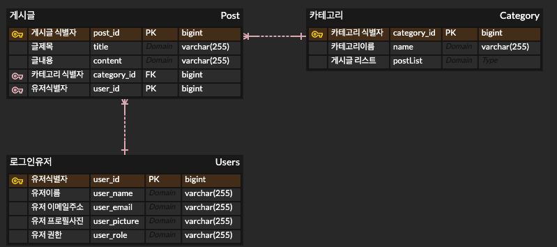

# blog-aws-practice

## ERD

## 프로젝트 일지
프로젝트를 만들면서, 프로젝트 일지를 작성했습니다.
- [프로젝트 일지 바로가기](https://robust-price-530.notion.site/049dff13906643878a9f2c7e40ee44f3)

## Error Log
프로젝트를 만들면서 부딪혔던 문제들과 에러에 대한 해결 과정을 작성했습니다.
- [에러 로그 바로가기](https://robust-price-530.notion.site/ERROR-LOG-5e4b68af096b40f480c4c023c4e797c5)
- [OAuth2, Session, 그리고 테스트](https://velog.io/@kimsy8979/OAuth2-Session-%EA%B7%B8%EB%A6%AC%EA%B3%A0-%ED%85%8C%EC%8A%A4%ED%8A%B8)